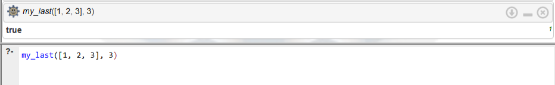
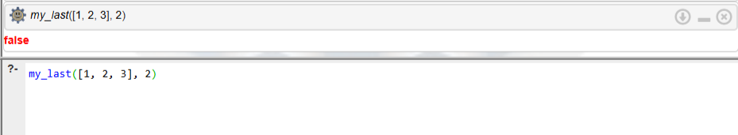
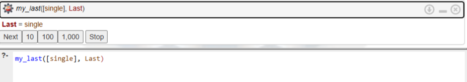
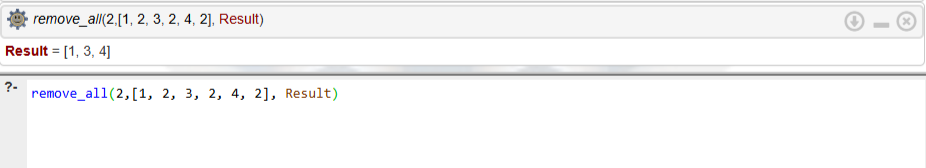
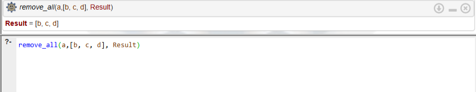
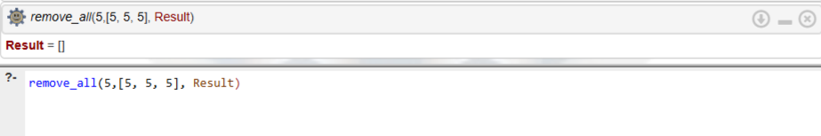

# Лабораторная работа 2: Списки на языке Prolog
**Студентка:** Кузнецова Татьяна  
**Группа:** ЭВМб-23-1

## Цель работы
Приобрести навыки рекурсивной обработки рекурсивных структур данных; научиться интерпретировать (переводить на естественный язык) Пролог-программы.

## Инструментарий
Работа выполнялась в онлайн-среде логического программирования [SWISH SWI-Prolog](https://swish.swi-prolog.org).

---

## Задание 1
**Условие:** Опpеделить последний элемент списка.

**Декларативная интерпретация:** Последний элемент одноэлементного списка — это и есть этот единственный элемент. Если список содержит более одного элемента, то последний элемент этого списка равен последнему элементу его хвоста.  
**Процедурная интерпретация:** Чтобы найти последний элемент списка, нужно проверить: если список содержит лишь один элемент, то предъявить в качестве результата этот первый элемент. Иначе: отделить голову списка, рекурсивно найти последний элемент в оставшемся хвосте и выдать его как результат.

### Запросы и результаты:

1. **Найти последний элемент обычного списка.**
   * **Запрос:** `my_last([a, b, c, d, e], Last).`
   * **Результат:** `Last = e`
   
   

2. **Проверить, является ли элемент последним (верно).**
   * **Запрос:** `my_last([1, 2, 3], 3).`
   * **Результат:** `true`
   
   

3. **Проверить, является ли элемент последним (ложно).**
   * **Запрос:** `my_last([1, 2, 3], 2).`
   * **Результат:** `false`
   
   

4. **Найти последний элемент списка из одного элемента.**
   * **Запрос:** `my_last([single], Last).`
   * **Результат:** `Last = single`
   
   

---

## Задание 2
**Условие:** Удалить все вхождения заданного элемента из списка.

**Декларативная интерпретация:** Результат удаления любого элемента из пустого списка есть пустой список. Результат удаления элемента `X` из списка, голова которого равна `X`, в точности совпадает с результатом удаления `X` из хвоста списка. Результат удаления `X` из списка, голова которого `H` (и `H` не равно `X`), представляет собой список с головой `H` и хвостом, равным результату удаления `X` из хвоста исходного списка.  
**Процедурная интерпретация:** Чтобы удалить элемент `X` из списка:
1. Если исходный список пуст, возвращаем пустой список. 
2. Если голова списка равна `X`, отбрасываем её и рекурсивно вызываем функцию для хвоста списка. 
3. Если голова списка не равна `X`, рекурсивно обрабатываем хвост, а затем присоединяем текущую голову к началу полученного результата.

### Запросы и результаты:

1. **Удалить элемент, который встречается несколько раз.**
   * **Запрос:** `remove_all(2,[1, 2, 3, 2, 4, 2], Result).`
   * **Результат:** `Result = [1, 3, 4]`
   
   

2. **Попытаться удалить элемент, которого нет в списке.**
   * **Запрос:** `remove_all(a, [b, c, d], Result).`
   * **Результат:** `Result = [b, c, d]`
   
   

3. **Удалить элемент из пустого списка.**
   * **Запрос:** `remove_all(1,[], Result).`
   * **Результат:** `Result = []`
   
   

4. **Удалить элемент из списка, состоящего только из этих элементов.**
   * **Запрос:** `remove_all(5, [5, 5, 5], Result).`
   * **Результат:** `Result = []`
   
   

---

## Вывод
В результате выполнения данной лабораторной работы я:
1. Познакомилась со списковой формой записи в Prolog и научилась использовать конструкцию `[H | T]` для разделения списка на голову и хвост.
2. Освоила рекурсивную обработку структур данных, научилась определять базовые случаи (граничные условия) и рекурсивные переходы (индуктивный шаг).
3. Научилась формулировать декларативную интерпретацию (смысл отношений: "ЧТО должно быть результатом") и процедурную интерпретацию (смысл вычислений: "КАК этот результат достигается").
4. Применила встроенный оператор сравнения на неравенство `\=` для ветвления логики программы.
